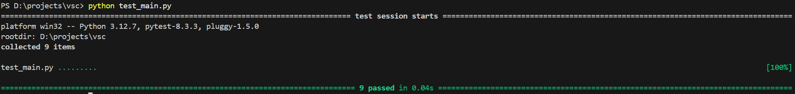

# Домашнее задание №4
___
## Описание
Этот проект представляет собой ассемблер и интерпретатор для учебной виртуальной машины (УВМ).
___
main.py - Главный файл программы, который содержит логику для ассемблера и интерпретатора. Он принимает команды из командной строки для ассемблирования исходного кода в бинарный файл и интерпретации бинарного кода. В коде есть комментарии для понимания написанного.

input.txt - Файл, содержащий текстовую версию исходной программы в формате инструкций. Используется ассемблером для генерации бинарного кода.

log.xml - Файл лога, в котором сохраняются все ассемблированные инструкции в формате XML. Лог помогает отслеживать, как исходная программа преобразована в машинный код.

output.bin - Бинарный файл, в который записан сгенерированный машинный код из исходной программы. Этот файл используется интерпретатором для выполнения команд.

result.xml - Файл с результатами выполнения интерпретатора. Содержит значения памяти, прочитанные из заданного диапазона адресов, и представленные в формате XML

test_main.py - Тестирование базовых функций
___
## Тестирование с помощью Pytest 

